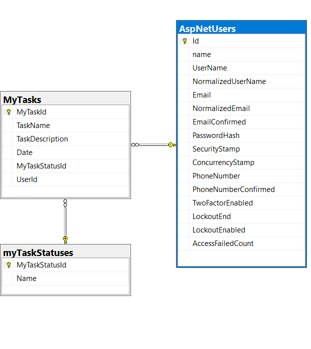
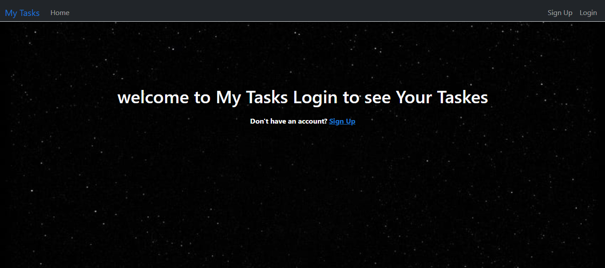
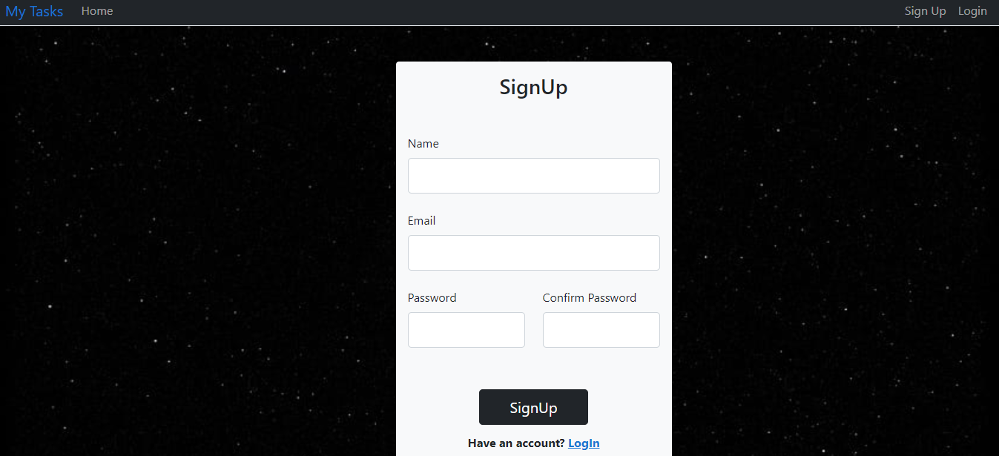
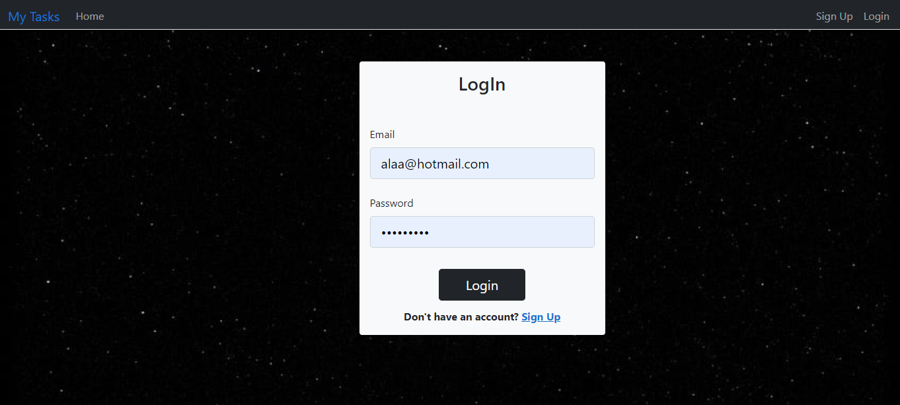
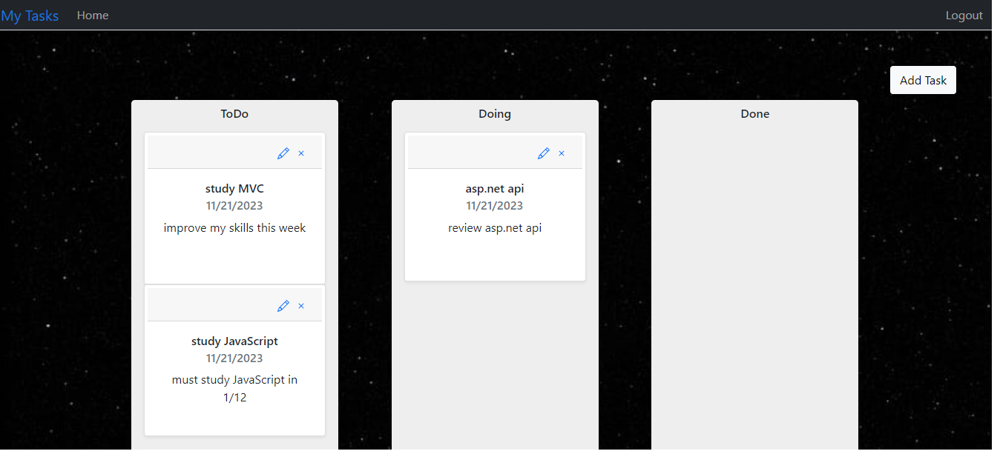
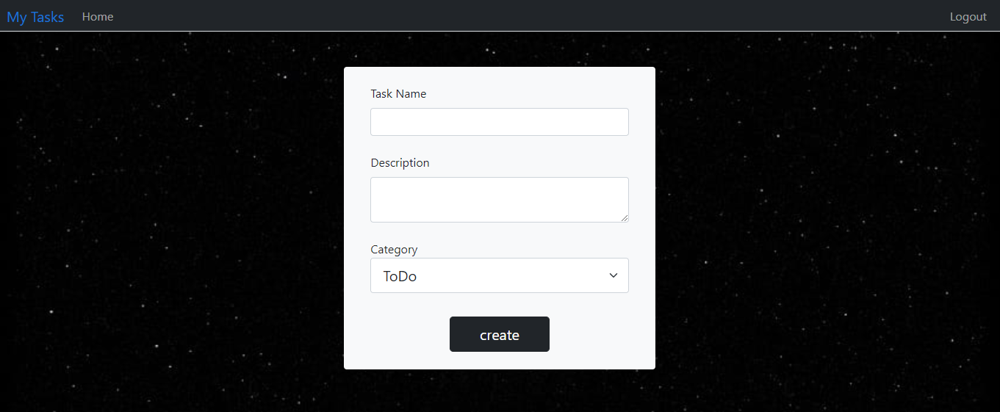
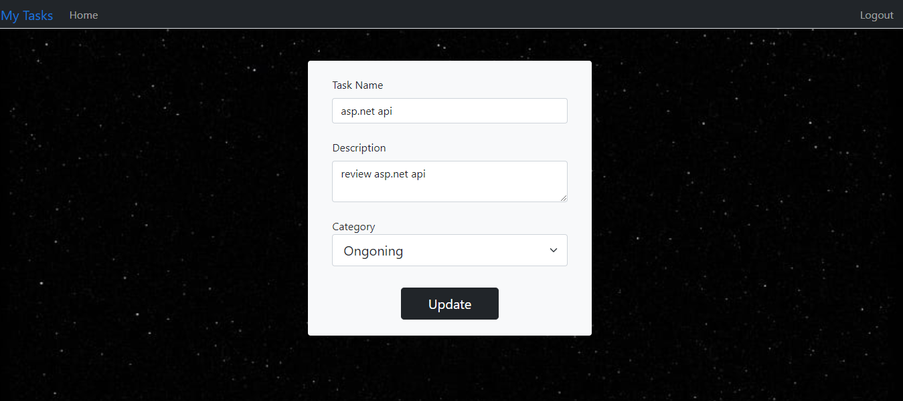
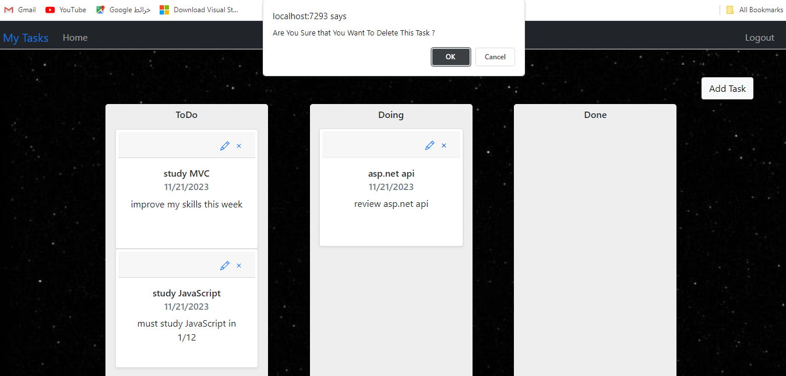

# MyTasks Web Application 
##  Contents
- [Introduction](#introduction)
- [Deployment](#deployment)
- [Database Schema](#database-schema)
- [Explanation of Database Schema](#explanation-of-database-schema)

## Introduction

+ Welcome to MyTasks Web Application README.
## Deployment

- **Website Link**: [MyTasks Web Application]()

---

## Database Schema

Our database schema primarily consists of the following tables:

- **Users**: Stores information about registered users.
 - **MyTask**: store taskes and important details.

- **MyTaskStatus**:defining the status for tasks.
---
## ERD (Entity Relationship Diagram)

## How to use it locally

- clone the repository to your device
- open it using visual studio
- open package manager console and update the data base(sql database)
- run the application
- 
## User Interface 
### some photos represent the Application from the User Side

+ Main Page for the user

+ Register Page 

+ Login Page 

+ MyTasks Page 

+ Add task Page 

+ Update Page 

+ delete Page 
